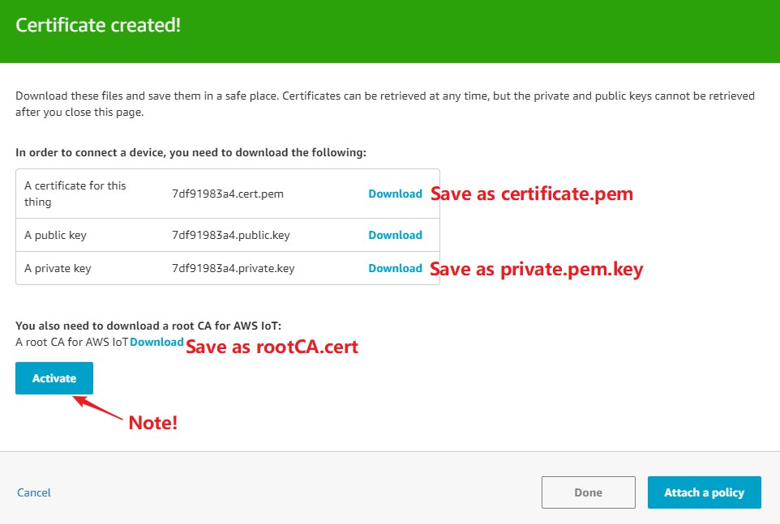
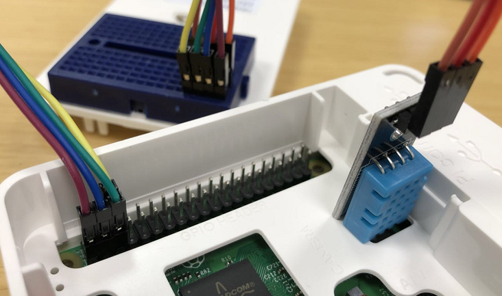
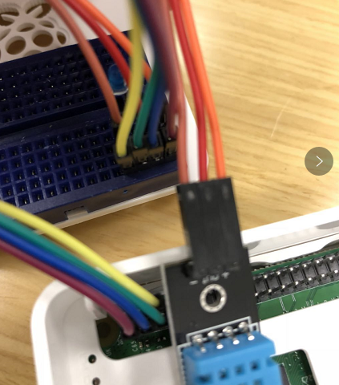

## Device Registry

You should create resource on AWS console.

*  Register a Device in the Thing Registry

In this demo, your must create Thing that name is *"raspberry<XX>"*

[http://docs.aws.amazon.com/iot/latest/developerguide/register-device.html](http://docs.aws.amazon.com/iot/latest/developerguide/register-device.html)

* Create and Activate a Device Certificate and Active it.

[http://docs.aws.amazon.com/iot/latest/developerguide/create-device-certificate.html](http://docs.aws.amazon.com/iot/latest/developerguide/create-device-certificate.html)
> download all certificates, some certificates won't be allow to download after this page close.



After completing this section, you should above three files (certificate.pem, private.pem.key, and rootCA.cert) in the local ~/cert file, which will be used for subsequent connections to the AWS IoT platform. In addition, you can see the certificate, security policy, device shadow you created in the AWS IoT console. AWS provides different solutions for customers with different needs. In actual production, you can use a familiar programming language SDK to use different device registration methods according to your own situation.

* Create an AWS IoT Policy

[http://docs.aws.amazon.com/iot/latest/developerguide/create-iot-policy.html](http://docs.aws.amazon.com/iot/latest/developerguide/create-iot-policy.html)

* Attach an AWS IoT Policy to a Device Certificate

[http://docs.aws.amazon.com/iot/latest/developerguide/attach-policy-to-certificate.html](http://docs.aws.amazon.com/iot/latest/developerguide/attach-policy-to-certificate.html)

* Attach a Certificate to a Thing

[http://docs.aws.amazon.com/iot/latest/developerguide/attach-cert-thing.html](http://docs.aws.amazon.com/iot/latest/developerguide/attach-policy-to-certificate.html)


Optionally you can put your cert file in the same directory: ~/cert

## Configure Your Raspberry Pi

#### Connect sensor and diode to Raspberry Pi

* **DHT11**：

DHT11 is a temperature and humidity sensor, divided into three interfaces, namely: VCC (+ positive), DATA, GND (- negative)

VCC | Power | +, input 3V-5.5V |

DATA | Data Output | Output Pins |

GND | Ground | -, Ground Pin |


DHT11 wiring instructions

1. VCC connected to 3V3, you can choose 1 or 17
2. DATA connected to the GPIO port, I chose GPIO2, the third port
3. GND is connected to the ground, and I chose the 14th port



Connect the diode to **GPIO3**



Please note that the diode is divided into positive and negative electrodes, the long end is positive, and the short end is negative.

### Copy Cert file to raspberry pi 

After the Raspberry Pi system has been burned, connect the raspberry to the network, find the Raspberry Pi IP address, and log in to the Raspberry Pi using VNC or SSH.

Raspberry Pi default SSH account password:

**Username：pi**

**Password：raspberry**

Now you can use rsync to move your cert file to your raspberry pi.

```
rsync -r ~/cert/ pi@<your_ip_address>:~/
```

After login to Raspberry Pi, please install Git

```
sudo apt-get install git
```

Download the device code：

```
cd ~
rm -r aws-iot-labs (option)
git clone https://github.com/cncoder/aws-iot-labs.git
```

Copy cert file to the aws-iot-labs/Lab-1-deviceSimulator directory

```
mv ~/cert ~/aws-iot-labs/Lab-1-deviceSimulator
```

### 🚨⚠️🥁🎺 ULTRA SUPER IMPORTANT SPECIAL NOTE PLEASE READ THIS 🎺🥁⚠️🚨 ###

Make sure that every time you enter the same thing name (Thing Name) (raspberry<XX>)


## Connect Raspberry Pi to AWS IoT

Switch to aws-iot-raspberrypi directory

```
cd ~/aws-iot-labs/Lab-1-deviceSimulator
```

install AWS IoT SDK

```
sudo pip install AWSIoTPythonSDK
```

Modify the ThingShadowAgent.py file configuration, we will edit this file via vi

```
vi ThingShadowAgent.py
```

endpoint：Login to your AWS IoT console, Select the settings on the left. The endpoint on the page is the endpoint. This is unique for each area of each AWS account.

thingName：**raspberry<XX>**

topic：”**raspberry<XX>/sensor/data”**

Running ThingShadowAgent.py

```
python ThingShadowAgent.py
```

At this point, you can see that the raspberry row has a lot of output, and that the connection has been successful, sending MQTT data.

Now we can use the AWS IoT console to go to the thing shadow to see the Raspberry Pi uploaded to the AWS IoT platform data.

1. Open the AWS IoT Console
2. Select Manage on the left => Things
3. Click on the shadow of the thing you created in the previous section


