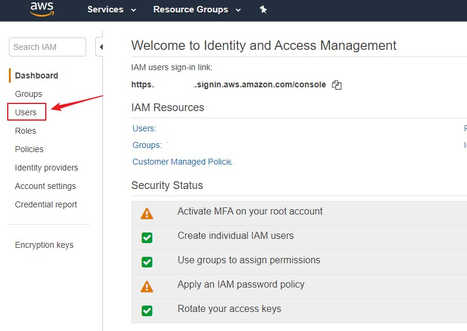
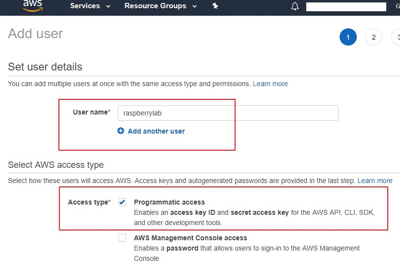
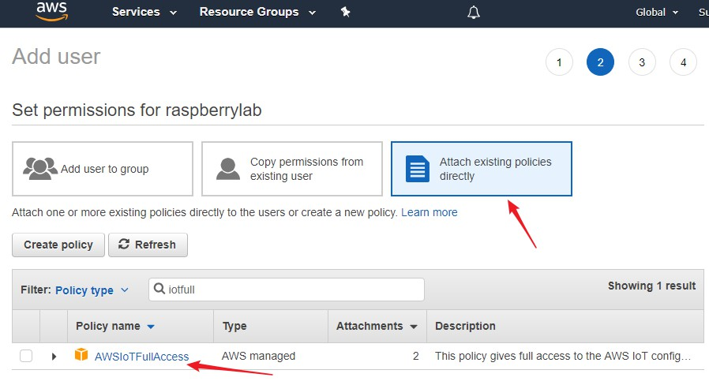
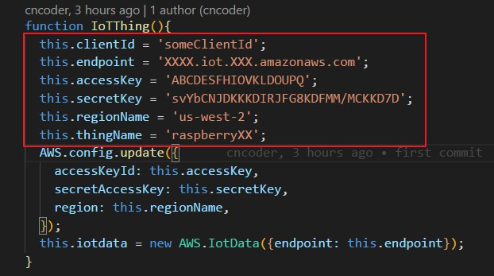
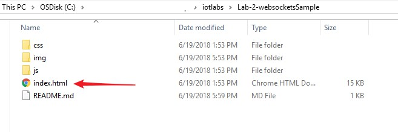
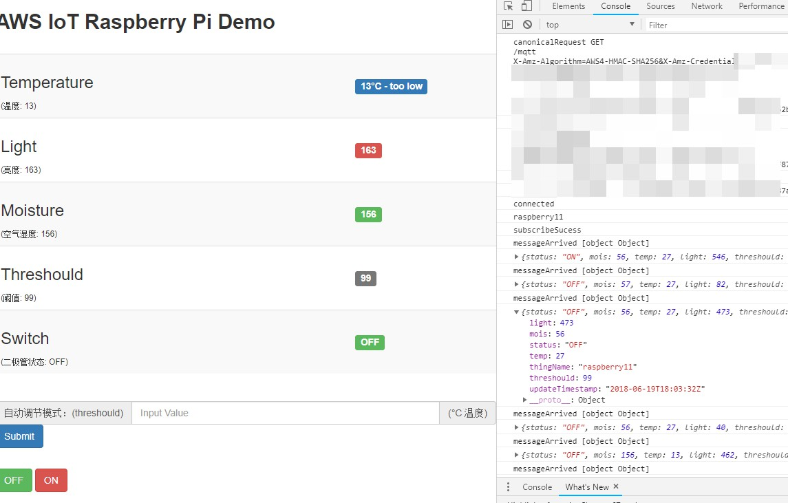

## Remotely view sensor data and control devices over Websockets

### Create IAM User to connect AWS IoT

We need to create a user for this Lab. The first role will be an instance profile that we will launch security monkey into. The permissions on this user allow the webpage to use websockets to connect to AWS IoT.

Creating the IAM User

1. To create a new user, navigate to the IAM section of the AWS console. Once there, select "Users": 



2. Once there, click "Create user": 




3. You will be asked to attach a (managed) policy (Attach Policy page). Please select the "AWSIoTFullAccess":



4. Save Access key ID


At this point, you now have a new IAM user named raspberrylab.
### Download Lab2 Code on your Laptop:

```
cd ~
git clone https://github.com/cncoder/aws-iot-labs.git
```

If your laptop hasn't installed git, you can downloaded it directly by this link.

[https://github.com/cncoder/aws-iot-labs/archive/master.zip](https://github.com/cncoder/aws-iot-labs/archive/master.zip)

Edit Lab-2-websocketsSample/js/iot.js file



Now you can open the index.html file, and start your web page, then turn on/off your diode.







