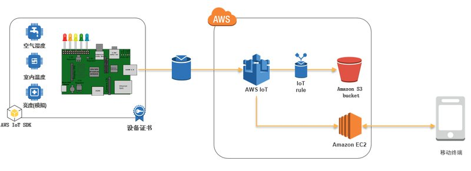

# aws-iot-hands-on lab with raspberry
Examples using AWS IoT (Internet of Things)

### Lab1

* deviceSimulator: Python script which publishing sensor data 

### Lab2
* websocketsSample: A reference implementation for connecting a web application to AWS IoT using MQTT-over-WebSockets.

### Lab3 (Rule)

# IoT动手实验 - 树莓派控制

也许您的树莓派放在家里已经吃灰很久了，本实验带把树莓派用起来。指导我们如何一步步的在AWS 平台搭建自己的的物联网设备，主要使用树莓派加传感器，通过MQTT 协议把传感器信息上传到AWS IoT 平台，同时移动终端终端通过访问AWS IoT，实时获取传感器信息，进一步控制设备。

### 准备工作

需要硬件设备：

- 树莓派一个
- 树莓派电源
- 内存卡一张（至少8G）
- 树莓派外壳

除了以上原来可能已经吃灰的设备，您可以在万能的X宝上轻松买到以下设备，我批量买入了十几套设备，每套成本算下来大约是5块钱。

- 一根二极管（一般都是一包买，本实验只需要用一根）
- 一个DHT11温湿度传感器（如果您对数据精确到有要求可以买DHT22）
- 面包板一个
- 杜邦线（两头母母）一排

如果您的树莓派还没有进行系统烧录，请根据树莓派官方指引进行操作：
https://www.raspberrypi.org/documentation/installation/installing-images/

本文实验使用的树莓派系统是：
https://downloads.raspberrypi.org/raspbian_lite_latest
